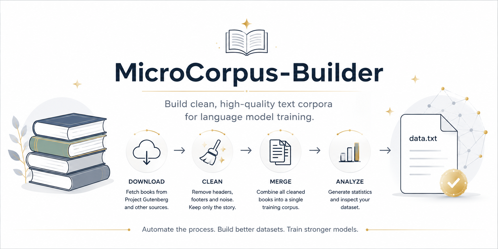

<p align="center">
  
</p>

<h1 align="center">📚 MicroCorpus-Builder</h1>

<p align="center">
Build clean, high-quality text corpora for language model training.
</p>

<p align="center">


</p>

---

# Overview

MicroCorpus-Builder is an open-source toolkit for creating high-quality text datasets suitable for training language models.

Instead of manually downloading books, cleaning Project Gutenberg headers, merging files, and checking dataset quality, the entire workflow is automated.

The builder downloads books, removes unnecessary metadata, preserves only the actual story text, merges everything into a single corpus, and generates useful statistics about the resulting dataset.

---

# Features

- 📥 Download books directly from Project Gutenberg
- 🧹 Automatically remove Gutenberg headers and footers
- 📖 Detect real chapter beginnings
- 📚 Remove duplicate table of contents
- 🗂 Merge hundreds of books into one dataset
- 📊 Generate dataset statistics
- 📝 Produce training-ready `data.txt`
- ⚡ Lightweight and fast
- 🔓 Completely open source

---

# Pipeline

```text
                Project Gutenberg
                       │
                       ▼
              Download Books
                       │
                       ▼
                Clean Metadata
                       │
                       ▼
          Detect Story Beginning
                       │
                       ▼
             Remove Noise & TOC
                       │
                       ▼
                Merge Corpus
                       │
                       ▼
             Generate Statistics
                       │
                       ▼
                 output/data.txt
```

---

# Repository Structure

```
MicroCorpus-Builder/
│
├── books/                 # Optional local books
├── raw/                   # Downloaded raw books
├── cleaned/               # Cleaned versions
├── output/
│   └── data.txt           # Final merged dataset
│
├── logs/                  # Processing logs
├── temp/                  # Temporary files
│
├── download.py            # Download books
├── clean.py               # Clean downloaded books
├── merge.py               # Merge corpus
├── stats.py               # Dataset statistics
├── builder.py             # Run entire pipeline
│
├── config.json
├── requirements.txt
└── README.md
```

---

# Installation

Clone the repository

```bash
git clone https://github.com/yourusername/MicroCorpus-Builder.git
cd MicroCorpus-Builder
```

Install dependencies

```bash
pip install -r requirements.txt
```

---

# Usage

## Download books

```bash
python download.py
```

---

## Clean books

```bash
python clean.py
```

---

## Merge corpus

```bash
python merge.py
```

---

## Dataset statistics

```bash
python stats.py
```

---

## Complete pipeline

```bash
python builder.py
```

---

# Example Output

```
Books       : 42
Words       : 18,572,941
Characters  : 108,345,937
Lines       : 512,884
Est. Tokens : 24,632,811
Size        : 112 MB
```

---

# Configuration

Books can be configured through

```
config.json
```

Example

```json
{
  "books": [
    {
      "title": "Alice's Adventures in Wonderland",
      "id": 11
    },
    {
      "title": "Dracula",
      "id": 345
    },
    {
      "title": "Frankenstein",
      "id": 84
    }
  ]
}
```

---

# Current Cleaning Features

- Removes Project Gutenberg headers
- Removes Project Gutenberg footers
- Removes duplicated Table of Contents
- Detects actual story beginning
- Preserves chapter structure
- Handles Roman numerals
- Handles Arabic chapter numbers
- Supports books with or without explicit CONTENTS sections
- UTF-8 with Latin-1 fallback

---

# Planned Features

- PDF extraction
- EPUB support
- HTML cleaning
- OCR text support
- Duplicate paragraph detection
- Language detection
- Automatic encoding detection
- Metadata export
- Dataset quality scoring
- Parallel processing
- Hugging Face Dataset export
- JSONL export
- Markdown export
- AI-assisted cleaning
- Custom cleaning rules

---

# Why MicroCorpus-Builder?

Training datasets are often the most time-consuming part of building language models.

MicroCorpus-Builder automates the repetitive work so you can focus on training instead of manually preparing text.

Whether you're creating a small GPT, experimenting with tokenizers, or building a large-scale corpus, this project provides a simple and reproducible workflow.

---

# License

Licensed under the MIT License.

---

# Author

**Durvesh Jadhav**

Built with ❤️ for open-source AI and language model research.